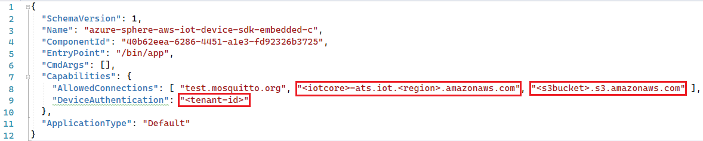
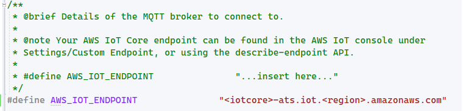
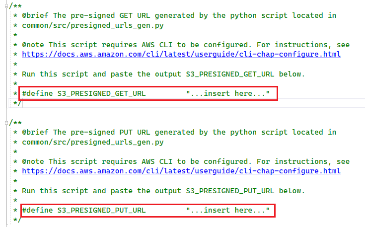
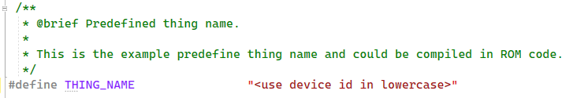
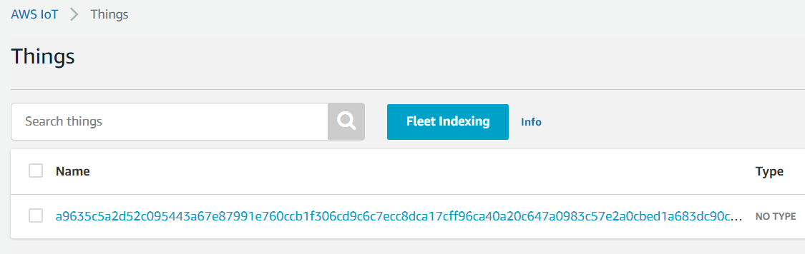
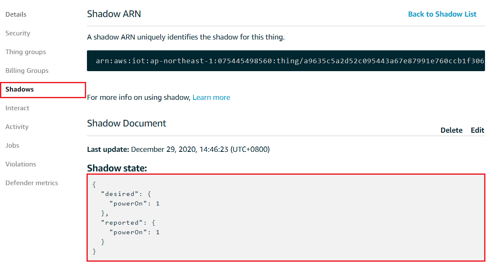

# AWS IoT device SDK for Embedded C on Azure Sphere

This project is a reference implemenation of AWS ioT device SDK for Embedded C running on Azure Sphere MT3620 MCU. It integrates multiple official demos include MQTT, HTTP and AWS IoT Shadow service. 

Azure Sphere MCU come with a hardware Root-of-Trust and device certificate lifecycle management service (AS3) to facilitate secure connection to any cloud. This project is also a complete demo of secure connection to a 3rd party IoT cloud. 

More specifically, AWS IoT Core support device Just-in-time-registeration, aka [JITR](https://aws.amazon.com/blogs/iot/just-in-time-registration-of-device-certificates-on-aws-iot/) mechanism. User can have a zero-touch provisioning expereience with high security and trustworthy when connect Azure Sphere MT3620 MCU to AWS IoT core 

## User Guide

### Prerequisite

1. Azure Sphere RDB from SeeedStudio or Azure Sphere EVK from Avnet
2. Minimum [Azure Sphere SDK](https://aka.ms/AzureSphereSDKDownload) is 20.10.
3. [Visual Studio Code](https://code.visualstudio.com/) or [Visual Studio 2019](https://visualstudio.microsoft.com/) installed on Windows 10 PC.
4. [Microsoft Account](https://docs.microsoft.com/en-us/azure-sphere/deployment/microsoft-account) to be used with Azure Sphere Developer Utility
5. [AWS Account](https://aws.amazon.com/) to host your services
6. [AWS CLI](https://aws.amazon.com/cli/) and [boto3](https://boto3.amazonaws.com/v1/documentation/api/latest/guide/quickstart.html#installation) are installed on your PC

### Setup for Azure Sphere 

1. Follow the guide of [Get started with a development kit](https://docs.microsoft.com/en-us/azure-sphere/install/overview) to setup your hardware and claim it your tenant. 
2. [Setup WiFi for Azure Sphere](https://docs.microsoft.com/en-us/azure-sphere/install/configure-wifi#set-up-wi-fi-on-your-azure-sphere-device) and ensure it get connected to internet. 
3. Put your device into development mode by
   
   ```
   azsphere device enable-development
   ```
4. Retrieve your Azure Sphere tenant ID and record for later use
   
   ```
   azsphere tenant show-selected
   ```
5. Retrieve your Azure Sphere device ID in lowercase for later use
   
   ```
   powershell -Command ((azsphere device show-attached)[0] -split ': ')[1].ToLower()
   ```   

### Setup for AWS environment

1. Login AWS and go to IAM service to [add a Programmatic access user](https://docs.aws.amazon.com/IAM/latest/UserGuide/id_users_create.html#id_users_create_console). Assign **AdministratorAccess** permission to this new user and record access id id and key
   
   

   

   

2. Open Windows command prompt, use AWS CLI to configure your credentials file by 

   ```
   aws configure
   ``` 

   You will be asked to provide access id and access key created in the previous step, and you also provide the default region code, refer to this [page](https://docs.aws.amazon.com/general/latest/gr/rande.html) to get the full list of supported region. E.g. `ap-northeast-1` is for Asia Pacific (Tokyo). 
   
   > Please note all resources in this demo will be depolyed to this default region.

3. All resources required on AWS IoT will be created by the preconfigure.py script using boto3 SDK. Go to the root of this project and run the script by

    ```
    python script/preconfigure.py
    ```

    The script need 30 seconds to finish. The resources configured on AWS are:

    - Azure Sphere Tenant CA certificate
    - AWS IoT Policy
    - IAM role with built-in polices assuming by Lambda function
    - JITR Lambda function with proper permission (function and its dependencies can be found [here](script/lambda))
    - AWS IoT Rule to monitor certificate register event and trigger lambda function

4. Go to [AWS IoT console](https://console.aws.amazon.com/iot/home) **Setting** page, record the **custom endpoint URL**
   
   

5. To test with HTTP upload and download use case, user must create your own bucket and generate presigned URL for authorized resource access.

### Build and deploy the application (VS2019)

1. Start Visual Studio 2019
2. From the **File** menu, select **Open > CMake...** and navigate to the folder that contains the sample.
3. Select the file CMakeLists.txt and then click **Open** to load the project.
4. Go to app_manifest.json file, replace `<iotcore>-ats.iot.<region>.amazonaws.com`, `<s3bucket>.s3.amazonaws.com` and `<tenant-id>` string with correct value record in previous steps
   
    

5. Go to .\azure-sphere-aws-iot-device-sdk-embedded-c\aws-iot-device-sdk-embedded-C\demos\demo_config.h, modify following macros.

    1. replace iotcore endpoint with your own uri
   
        

    1. define S3 presigned PUT and GET url
    
        

    1. replace thing name with your Azure Sphere device ID in lowercase. The thing identity will be created by lambda function for the first time device connect to AWS IoT core.
   
        
 

6. In Solution Explorer, right-click the CMakeLists.txt file, and select **Generate Cache for azure-sphere-aws-iot-device-sdk-embedded-c**. This step performs the cmake build process to generate the native ninja build files. 
7. In Solution Explorer, right-click the *CMakeLists.txt* file, and select **Build** to build the project and generate .imagepackage target.
8.  Double click *CMakeLists.txt* file and press F5 to start the application with debugging. The default code has enabled all 5 subroutines. 

### Verify result 

1.  Go to AWS IoT console **Manage**/**Things** page, your Azure Sphere device will be listed, the display name is azure sphere device id. 

    

2. click the thing to check the details, you can see the device shadow is created with some properties.
   
   

3.  Go to AWS IoT console **Secure**/**Certificates** page, you will see the device certificate in use is registered. Try to reboot your device, afer a while you will observe the device certificate id is changed but still linking to your device in the thing registry. 

    

4. Go to S3 console, open the right bucket and check the uploaded object content: Hello World!

## Workflow

Here is a diagram dipict the overall workflow 


## Note

   Device Shadow is not supported since azure sphere app do not know its device ID to construct proper MQTT topic
